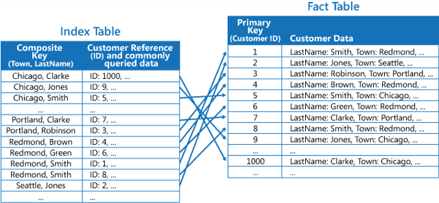
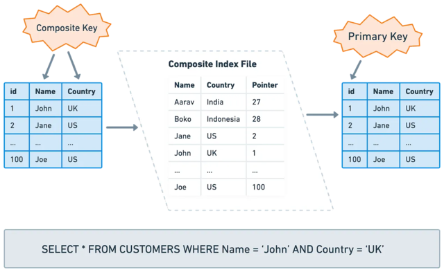

# Database Indexing Concepts

## Learning Goals

By the end of this guide, you will understand:

- How database indexes work and why they're essential for query performance
- Different types of indexes (Primary Key, Unique, Composite, Full-Text)
- How to define proper indexes based on cardinality and query patterns
- Best practices for managing indexes on high-traffic tables (MySQL & PostgreSQL)
- Trade-offs between query optimization and write performance
- PostgreSQL-specific scan types and EXPLAIN output

---

## Quick Comparison: MySQL vs PostgreSQL

| Feature                   | MySQL                    | PostgreSQL                             |
| ------------------------- | ------------------------ | -------------------------------------- |
| Default Index             | B-Tree                   | B-Tree                                 |
| Concurrent Index Creation | No (use tools)           | Yes (`CONCURRENTLY`)                   |
| Unique Indexes            | ✅ Yes                   | ✅ Yes                                 |
| Full-Text Indexes         | ✅ Yes                   | ✅ Yes (GIN)                           |
| Index Types               | B-Tree, Hash, Full-Text  | B-Tree, Hash, GiST, SP-GiST, GIN, BRIN |
| Query Planning            | EXPLAIN                  | EXPLAIN (more detailed)                |
| Scan Methods              | Sequential, Index, Range | Sequential, Index, Bitmap, Index-Only  |

---

# MySQL: Index Concepts & Best Practices

## 1. Overview: What is Database Indexing?

Database indexing is a technique used to improve the speed of data retrieval operations in tables. Without indexes, databases must perform full table scans—reading every row sequentially until finding matches. As tables grow, this becomes prohibitively expensive.

### Key Concept

Indexes create an ordered data structure that stores column values with pointers to the original table rows, enabling the database to find data much faster than scanning the entire table.

**Analogy**: Think of a book index. Instead of reading every page to find mentions of "optimization," you look it up in the index, which tells you exactly which pages contain that term.

### Why Indexes Matter

- **Read Performance**: 10-100x faster queries on indexed columns
- **Data Integrity**: Unique and primary key indexes enforce constraints
- **Operational Impact**: Prevents table locking issues that cause application latency
- **Cost Effectiveness**: Reduces database CPU, memory, and network usage

---

## 2. Index Types in MySQL

### Primary Key Index

A special index that **uniquely identifies each row** in a table. Every table should have one (either single-column or composite).

```sql
-- Primary key automatically creates an index
CREATE TABLE users (
  id INT AUTO_INCREMENT,
  email VARCHAR(255),
  PRIMARY KEY (id)
);
```

### Unique Index

Ensures **values in an indexed column cannot be duplicated**. Useful for enforcing data integrity.

```sql
ALTER TABLE users ADD UNIQUE INDEX idx_email (email);
```

### Regular (Non-Unique) Index

Standard index used to optimize searches on specific columns.

```sql
-- Single-column index
ALTER TABLE orders ADD INDEX idx_user_id (user_id);

-- Improves queries like: SELECT * FROM orders WHERE user_id = 123;
```

### Composite Index

Index on **two or more columns**, useful when queries filter by multiple columns.

```sql
ALTER TABLE orders ADD INDEX idx_user_date (user_id, created_at);

-- Optimizes: SELECT * FROM orders WHERE user_id = 123 AND created_at > '2024-01-01';
```

**Important**: Column order in composite indexes matters. The Leftmost Prefix rule applies—index `(A, B, C)` is useful for `WHERE A = x`, `WHERE A = x AND B = y`, but not for `WHERE B = y` alone.

### Full-Text Index

Specialized for searching large text fields efficiently.

```sql
ALTER TABLE articles ADD FULLTEXT INDEX idx_content (title, body);

-- Search query
SELECT * FROM articles WHERE MATCH(title, body) AGAINST('database indexing');
```

---

## 3. Index Concepts: Cardinality

### What is Cardinality?

Cardinality measures **how many unique values exist in a column**. High cardinality columns are better candidates for indexes.

| Column       | Unique Values | Total Rows | Cardinality | Good Index? |
| ------------ | ------------- | ---------- | ----------- | ----------- |
| `gender`     | 2             | 1M         | Very Low    | ❌ No       |
| `user_id`    | 1M            | 1M         | Very High   | ✅ Yes      |
| `created_at` | 500k          | 1M         | High        | ✅ Yes      |
| `status`     | 5             | 1M         | Very Low    | ❌ No       |

### Finding Cardinality

Use `SHOW INDEXES` to inspect index cardinality:

```sql
SHOW INDEXES FROM users \G

-- Look for the Cardinality column
-- Higher cardinality = more selective index = better performance
```

### Composite Index Ordering by Cardinality

For a query like:

```sql
SELECT id, clmn_a, clmn_b, clmn_c
FROM tbl_name
WHERE clmn_a = 234
AND clmn_b = 1234
ORDER BY clmn_c DESC;
```

**Don't** create `INDEX (clmn_a, clmn_b, clmn_c)`—it's suboptimal!

Instead, **order by descending cardinality**:

1. Find individual cardinalities:

   ```sql
   CREATE INDEX idx_a (clmn_a);
   CREATE INDEX idx_b (clmn_b);
   CREATE INDEX idx_c (clmn_c);
   SHOW INDEXES FROM tbl_name \G
   ```

2. If `clmn_b` has cardinality 226M, `clmn_a` has 6.7M, `clmn_c` has 720, then create:

   ```sql
   ALTER TABLE tbl_name ADD INDEX idx_composite (clmn_b, clmn_a, clmn_c);
   ```

---

## 4. Index Architecture: Visual References

### B-Tree Structure (Most Common)


MySQL uses B-Tree indexes by default. This structure keeps data balanced and sorted, allowing logarithmic lookup time O(log n) instead of linear O(n) full scans.

### Index Table Organization



The index stores column values in sorted order with row pointers, enabling quick range queries and sorting operations.

### Composite Index Behavior



Composite indexes create a multi-level sort order, making them efficient for queries that filter on multiple columns in the index order.

---

## 5. Pros and Cons of Indexing

### Advantages ✅

| Benefit                | Impact                                            |
| ---------------------- | ------------------------------------------------- |
| **Query Optimization** | 10-100x faster SELECT queries                     |
| **Data Integrity**     | Unique/Primary Key constraints prevent duplicates |
| **Text Search**        | Full-text indexes enable complex text queries     |
| **Reduced Locks**      | Faster queries = less table contention            |

### Trade-offs ⚠️

| Cost                     | Impact                                                              |
| ------------------------ | ------------------------------------------------------------------- |
| **Disk Space**           | Index files can be 20-50% of table size on large tables             |
| **Write Performance**    | INSERT/UPDATE/DELETE operations become slower (must update indexes) |
| **Memory Usage**         | Large indexes consume RAM and buffer pool space                     |
| **Maintenance Overhead** | Fragmented indexes degrade performance over time                    |

---

## 6. Index Anti-Patterns and Solutions

### Problem: Sorting by Primary Key

```sql
-- ❌ BAD: Inefficient sorting by ID when better options exist
SELECT * FROM orders WHERE user_id = 123 ORDER BY id DESC;
```

**Issue**: MySQL doesn't use an optimal index when combining filter and sort on different columns with different cardinality.

**Solution**: Create composite index matching query pattern:

```sql
-- ✅ GOOD: Index on (user_id, created_at)
ALTER TABLE orders ADD INDEX idx_user_created (user_id, created_at DESC);

-- Rewrite query
SELECT * FROM orders WHERE user_id = 123 ORDER BY created_at DESC;
```

### Problem: Too Many Indexes

Creating an index for every column slows writes significantly.

**Solution**: Index only frequently queried columns:

```sql
-- Review slow query log
SET GLOBAL slow_query_log = 'ON';
SET GLOBAL long_query_time = 1;

-- Then create indexes only for slow queries
```

### Problem: Indexing Low-Cardinality Columns

```sql
-- ❌ DON'T index status (only 5 unique values)
ALTER TABLE orders ADD INDEX idx_status (status);
```

**Solution**: Use covering indexes for read-heavy queries, skip indexes for high-volume writes.

---

## 7. Managing Indexes on High-Traffic Tables

### The Problem

Adding an index to a large table **locks it completely**, preventing all reads and writes. On production systems, this causes downtime and application errors.

### Solution: Zero-Downtime Migrations

#### MySQL: Use Schema Migration Tools

| Tool                                                                    | Feature                          | Use Case                |
| ----------------------------------------------------------------------- | -------------------------------- | ----------------------- |
| [gh-ost](https://github.com/github/gh-ost)                              | Online DDL, GitHub's tool        | Large tables (100GB+)   |
| [pt-online-schema-change](https://www.percona.com/doc/percona-toolkit/) | Percona Toolkit, proven & stable | Enterprise environments |
| [LHM](https://github.com/soundcloud/lhm)                                | SoundCloud's tool, lightweight   | Medium tables           |

Example with gh-ost:

```bash
gh-ost \
  --user=<user> \
  --password=<password> \
  --host=<host> \
  --database=<database> \
  --table=<table_name> \
  --alter="ADD INDEX idx_new_column (new_column)" \
  --execute
```

---

## 8. MySQL: Runnable Examples

### Example 1: Analyze Query Performance with EXPLAIN

```sql
-- Set up test data
CREATE TABLE IF NOT EXISTS products (
  id INT AUTO_INCREMENT PRIMARY KEY,
  name VARCHAR(255),
  category VARCHAR(50),
  price DECIMAL(10, 2),
  created_at TIMESTAMP DEFAULT CURRENT_TIMESTAMP
);

-- Insert test records (adjust the number as needed)
INSERT INTO products (name, category, price) VALUES
('Laptop', 'Electronics', 899.99),
('Mouse', 'Electronics', 29.99),
('Keyboard', 'Electronics', 79.99),
('Desk Chair', 'Furniture', 299.99),
('Monitor', 'Electronics', 449.99);

-- Query WITHOUT index - full table scan
EXPLAIN SELECT * FROM products WHERE category = 'Electronics';

-- Create index
ALTER TABLE products ADD INDEX idx_category (category);

-- Query WITH index - index scan (much faster!)
EXPLAIN SELECT * FROM products WHERE category = 'Electronics';
```

**Expected Output**:

- Without index: `type: ALL`, `possible_keys: NULL`
- With index: `type: ref`, `possible_keys: idx_category`

### Example 2: Composite Index for Multiple Columns

```sql
-- Create test table
CREATE TABLE IF NOT EXISTS orders (
  id INT AUTO_INCREMENT PRIMARY KEY,
  user_id INT,
  product_id INT,
  quantity INT,
  created_at TIMESTAMP DEFAULT CURRENT_TIMESTAMP
);

-- Insert sample data
INSERT INTO orders (user_id, product_id, quantity) VALUES
(101, 1, 2),
(102, 2, 1),
(101, 3, 5),
(103, 1, 1);

-- Query that benefits from composite index
SELECT * FROM orders WHERE user_id = 101 AND created_at > '2024-01-01' ORDER BY created_at DESC;

-- Create composite index (high to low cardinality)
ALTER TABLE orders ADD INDEX idx_user_date (user_id, created_at DESC);

-- Now run EXPLAIN to verify index usage
EXPLAIN SELECT * FROM orders WHERE user_id = 101 AND created_at > '2024-01-01' ORDER BY created_at DESC;
```

### Example 3: Monitor Slow Queries

```bash
# Enable slow query log (run on MySQL server)
mysql> SET GLOBAL slow_query_log = 'ON';
mysql> SET GLOBAL long_query_time = 1;  # Log queries taking > 1 second
mysql> SET GLOBAL log_queries_not_using_indexes = 'ON';

# Tail the slow query log
tail -f /var/log/mysql/slow.log

# Analyze with pt-query-digest
pt-query-digest /var/log/mysql/slow.log | head -20
```

### Example 4: Find Unused Indexes

```sql
-- Find unused indexes (in MySQL 5.7+)
SELECT object_name, count_star
FROM performance_schema.table_io_waits_summary_by_index_usage
WHERE object_schema != 'mysql'
ORDER BY count_star DESC;

-- Drop unused indexes to reduce write overhead
-- ALTER TABLE <table> DROP INDEX <unused_index>;
```

---

---

# PostgreSQL: Index Concepts & Advanced Features

## 1. PostgreSQL Indexing Fundamentals

### Overview

Indexes are a fundamental database performance tool. PostgreSQL supports multiple index types beyond the basic B-Tree, making it highly flexible for various workload patterns.

**Key Difference from MySQL**: PostgreSQL supports **concurrent index creation** without table locks, which is critical for production systems.

### Creating Indexes

Basic index creation:

```sql
CREATE TABLE test1 (
  id INTEGER,
  content VARCHAR
);

-- Standard index
CREATE INDEX test1_id_index ON test1 (id);

-- Remove index
DROP INDEX test1_id_index;
```

### Locking During Index Creation

**Default Behavior (Locks Table)**:

```sql
-- ❌ This locks the table against writes
CREATE INDEX idx_new ON large_table (column);

-- Other transactions will BLOCK if they try to INSERT/UPDATE/DELETE
```

**Concurrent Creation (No Lock)**:

```sql
-- ✅ RECOMMENDED for production
CREATE INDEX CONCURRENTLY idx_new ON large_table (column);

-- Other transactions can continue reading/writing
-- BUT: Requires 2 table scans + more CPU/IO
-- AND: Takes significantly longer than standard index creation
```

---

## 2. PostgreSQL Index Types

| Type        | Use Case                       | Example                                                    |
| ----------- | ------------------------------ | ---------------------------------------------------------- |
| **B-Tree**  | Default, most common           | `CREATE INDEX idx ON table (column)`                       |
| **Hash**    | Equality comparisons           | `CREATE INDEX idx USING HASH ON table (column)`            |
| **GiST**    | Geometric types, full-text     | `CREATE INDEX idx USING GIST ON table USING GIST (column)` |
| **SP-GiST** | Partitioned space-partitioning | Spatial data with clustering                               |
| **GIN**     | Full-text search, arrays       | `CREATE INDEX idx USING GIN ON table (column)`             |
| **BRIN**    | Large tables, sequential       | `CREATE INDEX idx USING BRIN ON table (column)`            |

### Unique Indexes

Enforce uniqueness at the database level:

```sql
-- Only B-Tree indexes can be declared unique
CREATE UNIQUE INDEX name ON table (column [, ...]);

-- Key properties:
-- - Multiple rows with equal values not allowed
-- - NULL values are NOT considered equal to each other
-- - Multicolumn unique indexes reject only when ALL columns match
```

---

## 3. PostgreSQL Query Performance: EXPLAIN

### Basic EXPLAIN

```sql
EXPLAIN SELECT * FROM tenk1;

-- QUERY PLAN
-- -------------------------------------------------------------
-- Seq Scan on tenk1  (cost=0.00..458.00 rows=10000 width=244)
```

### Understanding EXPLAIN Output

The numbers in parentheses represent (left to right):

| Metric            | Meaning                                         |
| ----------------- | ----------------------------------------------- |
| **Start-up cost** | Time before output can begin (e.g., sorting)    |
| **Total cost**    | Estimated total time if plan runs to completion |
| **Rows**          | Estimated number of rows output                 |
| **Width**         | Estimated average width of rows in bytes        |

---

## 4. PostgreSQL Scan Types

PostgreSQL offers more scan methods than MySQL, enabling better optimization.

### Sequential Scan

Scans all rows sequentially, checking each against the predicate.

```sql
-- Create demo table
CREATE TABLE demotable (num NUMERIC, id INT);
CREATE INDEX demoidx ON demotable(num);

-- Insert 1M rows
INSERT INTO demotable
  SELECT random() * 1000, generate_series(1, 1000000);

ANALYZE;  -- Update table statistics

-- Query that triggers sequential scan
EXPLAIN SELECT * FROM demotable WHERE num < 21000;

-- QUERY PLAN
-- -----------------------------------------------------------------------
-- Seq Scan on demotable  (cost=0.00..17989.00 rows=1000000 width=15)
--   Filter: (num < '21000'::numeric)
```

**When Used**:

- No index available on predicate column
- Query returns majority of rows (sequential I/O cheaper than random I/O)

### Index Scan

Uses index to locate rows, then fetches from heap.

```sql
-- Query returns few rows (selective)
EXPLAIN SELECT * FROM demotable WHERE num = 21000;

-- QUERY PLAN
-- -----------------------------------------------------------------------
-- Index Scan using demoidx on demotable  (cost=0.42..8.44 rows=1 width=15)
--   Index Cond: (num = '21000'::numeric)
```

**Two-Step Process**:

1. Use index to find TID (tuple identifier) of matching rows
2. Fetch data from heap page using TID

**Trade-off**: Index navigation + random I/O can be slower than sequential scan for high row counts

### Index-Only Scan

Scans only the index, never accesses the heap (fastest option).

```sql
-- Query fetches ONLY indexed columns
EXPLAIN SELECT num FROM demotable WHERE num = 21000;

-- QUERY PLAN
-- -----------------------------------------------------------------------
-- Index Only Scan using demoidx on demotable  (cost=0.42..8.44 rows=1 width=11)
--   Index Cond: (num = '21000'::numeric)
```

**Requirements**:

- Query must fetch only columns in the index
- All tuples on accessed pages must be visible (no visibility checks needed)

### Bitmap Scan

Hybrid approach combining benefits of index and sequential scans.

```sql
-- Query returns moderate number of rows (not too few, not too many)
EXPLAIN SELECT * FROM demotable WHERE num < 210;

-- QUERY PLAN
-- -----------------------------------------------------------------------
-- Bitmap Heap Scan on demotable  (cost=5883.50..14035.53 rows=213042 width=15)
--   Recheck Cond: (num < '210'::numeric)
--   -> Bitmap Index Scan on demoidx  (cost=0.00..5830.24 rows=213042 width=0)
--        Index Cond: (num < '210'::numeric)
```

**Process**:

1. **Bitmap Index Scan**: Fetch all matching TIDs from index, create bitmap (page numbers + offsets)
2. **Bitmap Heap Scan**: Sort bitmap by page number, scan heap sequentially by page

**Advantage**: Avoids random I/O spikes by batching heap access by page number

### Index-Only Scan vs. Bitmap Scan

Same query, different results based on columns selected:

```sql
-- Fetches ALL columns → Bitmap Scan (needs heap)
EXPLAIN SELECT * FROM demotable WHERE num < 210;
-- Result: Bitmap Heap Scan

-- Fetches ONLY indexed column → Index-Only Scan (no heap needed)
EXPLAIN SELECT num FROM demotable WHERE num < 210;
-- Result: Index Only Scan
```

---

## 5. PostgreSQL vs MySQL Query Plans

**MySQL EXPLAIN Output**:

```
| id | select_type | table | type | possible_keys | key | rows | filtered | Extra |
|  1 | SIMPLE      | users | ref  | idx_email     | idx | 1    | 100%     | NULL  |
```

**PostgreSQL EXPLAIN Output**:

```
Seq Scan on users
  Filter: (email = 'test@example.com')
  (cost=0.00..35.50 rows=1 width=100)
```

**Key Differences**:

- PostgreSQL shows tree of operations (parents/children)
- PostgreSQL estimates cost in arbitrary units (not rows examined)
- PostgreSQL supports more scan types (Bitmap, Index-Only, etc.)
- PostgreSQL ANALYZE provides actual execution stats

---

## 6. PostgreSQL: Runnable Examples

### Example 1: Create Large Test Dataset

```sql
-- Create demo table
CREATE TABLE person (
  name TEXT,
  salary INT,
  age INT
);

-- Generate 10 million rows
INSERT INTO person (name, salary, age)
SELECT
  UPPER(SUBSTR(MD5(RANDOM()::TEXT), 1, 6)),
  FLOOR(RANDOM() * (1000 - 100 + 1)) + 100,
  FLOOR(RANDOM() * (60 - 20 + 1)) + 20
FROM GENERATE_SERIES(1, 10000000);

-- Update table statistics
ANALYZE person;
```

### Example 2: Query Without Index (Full Scan)

```sql
-- Check table size
SELECT
  ROUND(PG_TOTAL_RELATION_SIZE('person') / 1024 / 1024, 2) AS size_mb;

-- Query without index
EXPLAIN SELECT * FROM person WHERE age > 50;

-- Expected: Seq Scan (scans all 10M rows)
```

### Example 3: Create Index and Compare

```sql
-- Create index
CREATE INDEX idx_age ON person (age);

-- Query with index
EXPLAIN SELECT * FROM person WHERE age > 50;

-- Expected: Seq Scan or Bitmap Scan (depending on row percentage)
-- If < 5% of rows: Index Scan
-- If > 10% of rows: Seq Scan
-- If 5-10%: Bitmap Scan
```

### Example 4: Concurrent Index Creation (Production Safe)

```sql
-- Standard (table locked during creation):
-- CREATE INDEX idx_salary ON person (salary);

-- Production-safe (allows concurrent writes):
CREATE INDEX CONCURRENTLY idx_salary ON person (salary);

-- Takes longer and more CPU/IO, but table remains usable
```

### Example 5: Compare Scan Types

```sql
-- Index Scan (very selective, small result set)
EXPLAIN SELECT * FROM person WHERE age = 45;
-- Result: Index Scan

-- Bitmap Scan (moderately selective, medium result set)
EXPLAIN SELECT * FROM person WHERE age > 40 AND age < 60;
-- Result: Bitmap Scan

-- Sequential Scan (low selectivity, large result set)
EXPLAIN SELECT * FROM person WHERE age > 20;
-- Result: Seq Scan
```

---

## 7. Additional Resources

### MySQL

- [MySQL SHOW INDEX Documentation](https://dev.mysql.com/doc/refman/8.0/en/show-index.html)
- [MySQL EXPLAIN Documentation](https://dev.mysql.com/doc/refman/8.0/en/explain.html)
- [Percona Toolkit](https://www.percona.com/doc/percona-toolkit/)
- [gh-ost: Online Schema Migration](https://github.com/github/gh-ost)

### PostgreSQL

- [PostgreSQL Index Types](https://www.postgresql.org/docs/current/indexes-types.html)
- [PostgreSQL CREATE INDEX Concurrently](https://www.postgresql.org/docs/current/sql-createindex.html)
- [PostgreSQL EXPLAIN](https://www.postgresql.org/docs/current/sql-explain.html)
- [PostgreSQL Performance Tips](https://www.postgresql.org/docs/current/performance-tips.html)

---

## Next Steps

1. **Read** [database/WORKSHOP.md](./WORKSHOP.md) for hands-on exercises (MySQL & PostgreSQL)
2. **Practice** creating and analyzing indexes locally with Docker
3. **Monitor** slow queries in production using respective tools
4. **Iterate** based on actual query patterns and performance metrics

