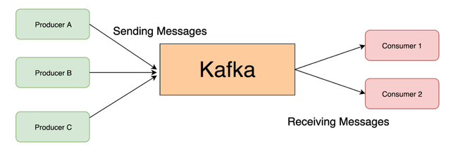
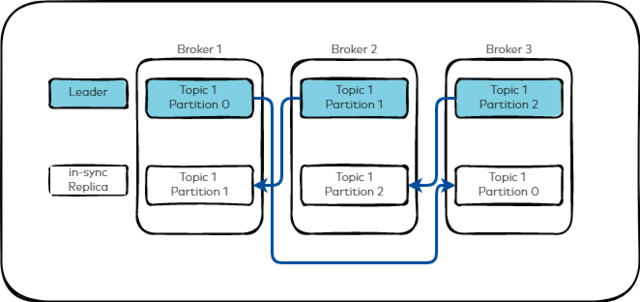

# Apache Kafka: Comprehensive Guide

## Learning Goals

By the end of this guide, you will understand:
- What Kafka is and why it's used for distributed streaming
- Kafka architecture: brokers, topics, partitions, and replicas
- Producer and consumer concepts with acknowledgment levels
- Kafka cluster configuration (static and dynamic)
- Operational procedures: creating topics, producing/consuming messages, managing offsets
- Partition reassignment for scaling operations
- Troubleshooting common Kafka issues

---

## 1. What is Apache Kafka?

**Apache Kafka** is a distributed streaming platform built for:
- **High-throughput**: Handle millions of messages per second
- **Low-latency**: Sub-second message delivery
- **Scalability**: Distribute data across multiple brokers
- **Durability**: Persist messages to disk with configurable retention
- **Ecosystem**: Large ecosystem of tools and integrations

### Key Characteristics

| Feature | Benefit |
|---------|---------|
| **Publish-Subscribe Model** | Producers and consumers are decoupled |
| **Distributed Architecture** | Fault tolerance through replication |
| **Persistent Storage** | Messages stored on disk, not lost on restart |
| **Partitioned Topics** | Parallel processing across multiple consumers |
| **Configurable Retention** | Time-based or size-based message cleanup |

### Use Cases

- Real-time data pipelines
- Event streaming applications
- Log aggregation
- Metrics collection
- Stream processing
- Microservices messaging

---

## 2. Kafka Architecture: Visual Overview


**High-Level Components**:
- **Zookeeper/KRaft**: Cluster coordination and metadata management
- **Brokers**: Core Kafka servers storing and serving messages
- **Topics**: Logical message channels (e.g., `orders`, `user-events`)
- **Partitions**: Parallel streams within topics for scaling
- **Producers**: Applications that send messages
- **Consumers**: Applications that read messages
- **Consumer Groups**: Groups of consumers coordinating consumption

---

## 3. Core Kafka Concepts

### 3.1: Broker

The **core of Kafka** — servers that store messages and serve requests.

**Key Points**:
- Each broker has a unique `broker.id`
- Single broker or clustered setup (minimum 3 for production)
- Each broker can hold multiple topics and partitions
- Brokers communicate with Zookeeper/KRaft for coordination

### 3.2: Topic

**Logical channel** where messages are published.

**Characteristics**:
- Unique name (e.g., `user-events`, `orders`)
- Messages are immutable (write-once, read-many)
- Updated data sent as new message (not overwritten)
- Supported by multiple producers and consumers simultaneously
- Data persists based on retention policy

### 3.3: Partition

**Physical subdivision** of a topic for parallel processing.

**Key Details**:
- Minimum: 1 partition per topic
- Each message within a partition assigned an `offset` (unique ID)
- Offsets start at 0 and increment sequentially
- Consumers read messages in order within a partition
- **Parallelism**: Number of consumers in a group limited by number of partitions

```
Topic: user-events
├── Partition 0: [msg0 (offset 0), msg3 (offset 1), msg6 (offset 2), ...]
├── Partition 1: [msg1 (offset 0), msg4 (offset 1), msg7 (offset 2), ...]
└── Partition 2: [msg2 (offset 0), msg5 (offset 1), msg8 (offset 2), ...]
```

### 3.4: Replica

**Copy of partition** for fault tolerance.

**Replica Roles**:
- **Leader**: Handles all reads and writes for the partition
- **Follower**: Replicates data from leader asynchronously
- Minimum: 1 replica (typically 3 for production)

**Replication Factor = 3**:
```
Partition 0 Leader: Broker 1
Partition 0 Replicas: Brokers 2, 3
(If Broker 1 fails, Broker 2 becomes new leader)
```

### 3.5: In-Sync Replicas (ISR)

**Replicas that are fully caught up** with the leader.

**Definition**:
- Always includes the partition leader
- Followers are ISR only if they haven't fallen behind
- If follower stops replicating, removed from ISR
- Affects acknowledgment (`acks=all`) behavior

```
Leader Offset: 1000
Follower 1 Offset: 1000 ✅ (In ISR)
Follower 2 Offset: 995 ❌ (Lagging, not in ISR)
```

### 3.6: Producer

**Application that publishes messages** to topics.

**Key Operations**:
```
Producer → [Partitioner] → Partition Selection → Broker
         ↓
       Acknowledgment (acks setting)
```

**Partitioner Strategy** (default):
- If key provided: Hash(key) % num_partitions
- If no key: Round-robin across partitions

### 3.7: Consumer

**Application that subscribes to topics** and processes messages.

**Consumption Model**:
- Reads messages in partition order (within partition only)
- Tracks position via `offset` (cursor)
- Can read from specific offset or from beginning/end

**Consumer Group**:
- Group of consumers for the same topic
- Each partition assigned to one consumer in group
- Enables parallel processing: 3 partitions → 3 consumers max per group
- Different groups read independently from same topic

### 3.8: Acknowledgment (ACK) Settings

Controls **durability vs. latency tradeoff** for producers.

| ACK Value | Behavior | Data Loss Risk | Latency |
|-----------|----------|----------------|---------|
| **acks=0** | Producer doesn't wait for broker response | ❌ High (data may be lost) | ✅ Lowest |
| **acks=1** | Waits only for leader to write to local log | ⚠️ Medium (if leader fails before replication) | ⚠️ Medium |
| **acks=all** | Waits for all in-sync replicas to confirm | ✅ Very Low (all replicas have data) | ❌ Highest |

**Production Recommendation**: `acks=all` for critical data

---

## 4. Kafka Cluster Coordination

### 4.1: Zookeeper vs. KRaft

**Zookeeper** (Legacy):
- Separate metadata store
- Leader-follower election for brokers
- Minimum 3 nodes for quorum

**KRaft** (Modern):
- Metadata management built into Kafka
- Simpler architecture, no external coordinator
- Quorum calculation: `QN = (N + 1) / 2`

**Quorum Requirement**:
```
3 Zookeeper nodes: Tolerates 1 node failure ✅
5 Zookeeper nodes: Tolerates 2 node failures ✅
```

---

## 5. Kafka Configuration: Static vs. Dynamic

### 5.1: Static Configuration

Located at: `[KAFKA_DIR]/config/server.properties`

Must restart broker to apply changes.

**Key Settings**:

```properties
# Broker Identity
broker.id=0

# Network
listeners=PLAINTEXT://[IP]:9092
advertised.listeners=PLAINTEXT://[IP]:9092

# Performance
num.network.threads=32
num.io.threads=32

# Storage
log.dirs=/data/kafka-logs-1,/data/kafka-logs-2,/data/kafka-logs-3
log.retention.hours=168
log.segment.bytes=524288000

# Replication
default.replication.factor=3
num.partitions=18

# Zookeeper Coordination
zookeeper.connect=[ZK-IP]:2181,[ZK-IP]:2181,[ZK-IP]:2181
```

### 5.2: Dynamic Configuration

Applied **without broker restart** using CLI tools.

**Tool**: `kafka-configs.sh`

```bash
# Change a config
/opt/kafka/bin/kafka-configs.sh --alter \
  --bootstrap-server broker-ip:9092 \
  --entity-type brokers \
  --entity-default \
  --add-config log.segment.bytes=524288000

# View current dynamic configs
/opt/kafka/bin/kafka-configs.sh --describe \
  --bootstrap-server broker-ip:9092 \
  --entity-type brokers
```

**Advantages**:
- No broker downtime
- Changes persist across restarts (stored in Zookeeper/KRaft)
- Ideal for adjusting retention, segment sizes, etc.

---

## 6. Producer and Consumer Operations

### 6.1: Producer Workflow



**Steps**:
1. Producer creates message with optional key and value
2. Partitioner determines target partition (via key or round-robin)
3. Message sent to broker leader for that partition
4. Leader writes to local log
5. Replicas replicate from leader
6. Acknowledgment sent based on `acks` setting
7. Producer receives confirmation or error

### 6.2: Consumer Workflow

```
Consumer → Query Broker for Next Offset → Fetch Messages → Process
   ↓
   Commit Offset (mark message as consumed)
```

**Offset Management**:
- **Automatic**: Consumer automatically commits after processing
- **Manual**: Application commits after successful processing
- **Reset**: Ability to replay messages by resetting offset

---

## 7. Replication & Durability



### 7.1: Replication Process

**Scenario**: Topic with replication factor 3

```
Message arrives at Partition 0, Leader on Broker 1:
1. Write to Leader (Broker 1) ✅
2. Broker 2 (follower) fetches and replicates ✅
3. Broker 3 (follower) fetches and replicates ✅
4. All three brokers now have identical data
```

### 7.2: Failure Scenarios

**Leader Broker Fails**:
- Zookeeper/KRaft detects failure
- New leader elected from ISR (Brokers 2 or 3)
- Producer/consumer automatically reconnect
- Messages not lost (data on surviving brokers)

**Follower Broker Fails**:
- Removed from ISR temporarily
- `acks=all` producers still succeed (leader + other replicas)
- Follower rejoins ISR when caught up

**Multiple Brokers Fail**:
- Risk depends on replication factor
- RF=1: Single failure = data loss
- RF=3: Can tolerate 2 failures

---

## 8. Topic Management

### 8.1: Create Topic

```bash
# With Zookeeper
kafka-topics.sh --create \
  --zookeeper zk-ip:2181 \
  --topic orders \
  --replication-factor 3 \
  --partitions 18

# With KRaft (no Zookeeper)
kafka-topics.sh --create \
  --bootstrap-server broker-ip:9092 \
  --topic orders \
  --replication-factor 3 \
  --partitions 18
```

### 8.2: List Topics

```bash
kafka-topics.sh --list --bootstrap-server broker-ip:9092
```

### 8.3: Describe Topic

```bash
# Show partition layout and replicas
kafka-topics.sh --describe \
  --bootstrap-server broker-ip:9092 \
  --topic orders

# Output:
# Topic: orders  Partitions: 18  Replicas: 3
# Partition  Leader  Replicas         ISR
# 0          1       [1, 2, 3]        [1, 2, 3]
# 1          2       [2, 3, 4]        [2, 3, 4]
# ...
```

### 8.4: Modify Topic (Dynamic)

```bash
# Change retention to 1 hour
kafka-configs.sh --alter \
  --bootstrap-server broker-ip:9092 \
  --entity-type topics \
  --entity-name orders \
  --add-config retention.ms=3600000
```

---

## 9. Producing Messages

### 9.1: Console Producer

```bash
# Interactive: type messages manually
kafka-console-producer.sh \
  --topic orders \
  --bootstrap-server broker-ip:9092

# Type messages (Ctrl+C to exit):
# > order1,100,USD
# > order2,200,EUR
```

### 9.2: Performance Test Producer

```bash
# Produce 1000 messages at 100 msg/s
kafka-producer-perf-test.sh \
  --topic orders \
  --num-records 1000 \
  --record-size 1024 \
  --throughput 100 \
  --producer-props \
    bootstrap.servers=broker-ip:9092 \
    acks=all

# Output:
# 1000 records sent, 98.52 records/sec
# Avg latency: 10.23 ms
# Max latency: 145 ms
```

### 9.3: Producer with Key

```bash
# Messages with same key go to same partition
kafka-console-producer.sh \
  --topic orders \
  --bootstrap-server broker-ip:9092 \
  --property "parse.key=true" \
  --property "key.separator=:"

# Type:
# > user123:order1,100
# > user123:order2,200  # Same partition (user123 is key)
# > user456:order3,150  # Different partition (user456 is key)
```

---

## 10. Consuming Messages

### 10.1: Console Consumer

```bash
# Read from beginning
kafka-console-consumer.sh \
  --topic orders \
  --bootstrap-server broker-ip:9092 \
  --from-beginning

# Read new messages only
kafka-console-consumer.sh \
  --topic orders \
  --bootstrap-server broker-ip:9092
```

### 10.2: Consumer Group

```bash
# Consume as part of group "order-processors"
kafka-console-consumer.sh \
  --topic orders \
  --bootstrap-server broker-ip:9092 \
  --group order-processors \
  --from-beginning

# Different groups can read same topic independently
kafka-console-consumer.sh \
  --topic orders \
  --bootstrap-server broker-ip:9092 \
  --group analytics-group \
  --from-beginning
```

### 10.3: List Consumer Groups

```bash
kafka-consumer-groups.sh \
  --list \
  --bootstrap-server broker-ip:9092

# Output:
# order-processors
# analytics-group
# payment-processors
```

---

## 11. Consumer Offset Management

### 11.1: Check Offset Lag

```bash
# Show offsets and lag for a consumer group
kafka-consumer-groups.sh \
  --describe \
  --group order-processors \
  --bootstrap-server broker-ip:9092

# Output:
# TOPIC      PARTITION  CURRENT-OFFSET  LOG-END-OFFSET  LAG
# orders     0          1050            1100            50
# orders     1          2020            2050            30
# orders     2          3005            3008            3
# Total LAG: 83 messages behind
```

**Interpretation**:
- `CURRENT-OFFSET`: Where this consumer group is at
- `LOG-END-OFFSET`: Latest message in partition
- `LAG`: Messages consumer hasn't processed yet

### 11.2: Reset Offset to Earliest

```bash
# Reset to beginning for all topics
kafka-consumer-groups.sh \
  --reset-offsets \
  --to-earliest \
  --group order-processors \
  --all-topics \
  --execute

# Reset for specific topic
kafka-consumer-groups.sh \
  --reset-offsets \
  --to-earliest \
  --group order-processors \
  --topic orders \
  --execute
```

### 11.3: Reset Offset to Latest

```bash
# Skip all current messages, start from latest
kafka-consumer-groups.sh \
  --reset-offsets \
  --to-latest \
  --group order-processors \
  --topic orders \
  --execute
```

### 11.4: Reset to Specific Offset

```bash
# Back up current offsets
kafka-consumer-groups.sh \
  --export \
  --group order-processors \
  --bootstrap-server broker-ip:9092 \
  --reset-offsets \
  --to-current \
  --dry-run > backup.txt

# Restore from backup
kafka-consumer-groups.sh \
  --reset-offsets \
  --from-file backup.txt \
  --group order-processors \
  --bootstrap-server broker-ip:9092 \
  --execute
```

---

## 12. Partition Reassignment

### Use Case: Scale Up or Down

When adding/removing brokers, redistribute partitions for balanced load.

#### 12.1: Scale-Up Example (3 → 5 brokers)

```bash
# Step 1: Create topic list
cat > topics.json <<EOF
{
  "version": 1,
  "topics": [
    {"topic": "orders"},
    {"topic": "payments"}
  ]
}
EOF

# Step 2: Generate proposed assignment
kafka-reassign-partitions.sh \
  --zookeeper zk-ip:2181 \
  --generate \
  --topics-to-move-json-file topics.json \
  --broker-list 0,1,2,3,4 \
  > reassign.json

# Step 3: Review proposed assignment in reassign.json

# Step 4: Execute reassignment
kafka-reassign-partitions.sh \
  --zookeeper zk-ip:2181 \
  --execute \
  --reassignment-json-file reassign.json

# Step 5: Monitor progress
kafka-reassign-partitions.sh \
  --zookeeper zk-ip:2181 \
  --verify \
  --reassignment-json-file reassign.json
```

#### 12.2: Fix Leader Imbalance

```bash
# After reassignment, elect preferred replicas
kafka-preferred-replica-election.sh \
  --bootstrap-server broker-ip:9092

# This ensures partition leaders are distributed evenly
```

---

## 13. Troubleshooting

### 13.1: Check Broker Connectivity

```bash
# Verify broker is reachable
telnet broker-ip 9092

# Or using nc
nc -zv broker-ip 9092

# Check broker status
sudo systemctl status kafka
```

### 13.2: Consumer Lag

```bash
# If lag is high, consumers are slow
kafka-consumer-groups.sh \
  --describe \
  --group order-processors \
  --bootstrap-server broker-ip:9092

# Solutions:
# - Increase num.consumer.instances (up to partition count)
# - Optimize consumer processing speed
# - Increase partition count and rebalance
```

### 13.3: Producer Failures

```bash
# Check if messages are being persisted
# Review logs on broker:
tail -f /var/log/kafka/server.log

# Common issues:
# - Broker not responding (check connectivity)
# - Authentication/authorization issues
# - Topic doesn't exist (auto-create disabled)
```

### 13.4: Disk Space Issues

```bash
# Purge messages by setting retention to 1 second temporarily
kafka-configs.sh \
  --alter \
  --bootstrap-server broker-ip:9092 \
  --entity-type topics \
  --entity-name orders \
  --add-config retention.ms=1000

# Wait 10 seconds for cleanup

# Restore retention
kafka-configs.sh \
  --alter \
  --bootstrap-server broker-ip:9092 \
  --entity-type topics \
  --entity-name orders \
  --add-config retention.ms=604800000
```

---

## 14. Additional Resources

- [Apache Kafka Documentation](https://kafka.apache.org/documentation/)
- [Confluent Kafka Documentation](https://docs.confluent.io/)
- [Kafka Configuration Reference](https://kafka.apache.org/documentation/#configuration)
- [Kafka CLI Tools Guide](https://kafka.apache.org/quickstart)
- [Kafka Performance Tuning](https://kafka.apache.org/documentation/#performance)

---

## Next Steps

1. **Read** [kafka/WORKSHOP.md](./WORKSHOP.md) for hands-on Docker lab
2. **Practice** creating topics, producing, and consuming locally
3. **Monitor** lag and rebalancing in your Kafka cluster
4. **Optimize** retention, partitions, and replication settings based on your workload
