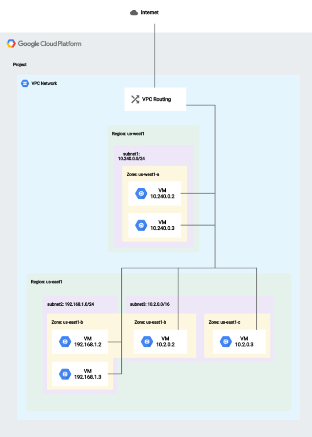
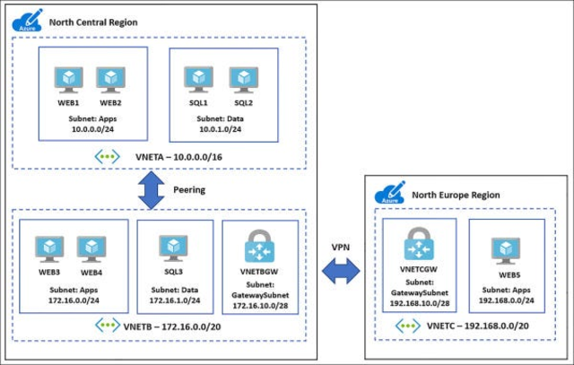
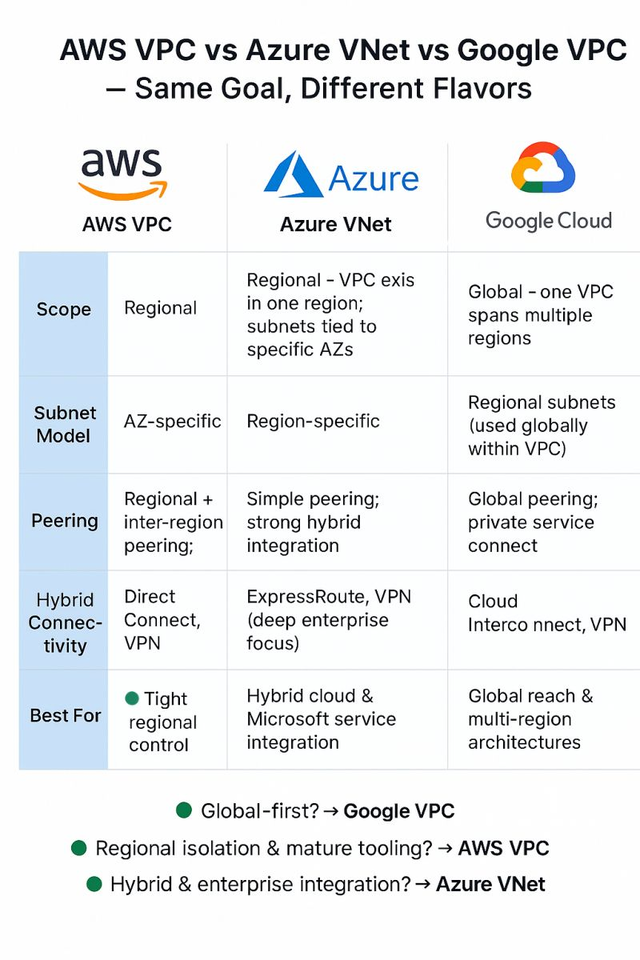

# Networking Concepts & Reference Guide

A comprehensive guide for understanding cloud networking fundamentals, from basic VPC architecture to advanced topics like BGP and IPSec tunnels.

## Table of Contents

- [Learning Goals](#learning-goals)
- [Part 1: Fundamentals (Beginner)](#part-1-fundamentals-beginner)
- [Part 2: Advanced Topics (Intermediate-Advanced)](#part-2-advanced-topics-intermediate-advanced)
- [Quick Reference Commands](#quick-reference-commands)
- [Additional Resources](#additional-resources)

---

## Learning Goals

### Beginner Goals
- Understand cloud network architecture and data flow
- Calculate and work with IP CIDR ranges
- Understand basic routing concepts
- Configure VPCs/VNets in GCP and Azure
- Apply firewall and NSG rules effectively
- Understand Network Address Translation (NAT)

### Advanced Goals
- Master Border Gateway Protocol (BGP) and its variants (iBGP/eBGP)
- Understand site-to-site IPSec VPN tunnels
- Interpret and analyze routing tables
- Troubleshoot network connectivity issues systematically

---

## PART 1: FUNDAMENTALS (BEGINNER)

### Visual Reference

**Diagrams** (see assets folder for full images):

-  — GCP VPC architecture with subnets and routes
-  — Azure VNet with NSG placement
-  — Architecture comparison

---

### 1. Networking Overview

A **network** is a group of interconnected resources or devices that communicate and exchange data. In cloud computing, it enables seamless communication between components (servers, VMs, storage) within or across data centers.

**Key responsibilities:**
- Routing data between components
- Ensuring delivery to correct destination
- Enabling seamless service-to-service communication

**Reference:** [Google Cloud Networking Overview](https://cloud.google.com/blog/topics/developers-practitioners/google-cloud-networking-overview)

---

### 2. IP CIDR Ranges

**CIDR notation** specifies IP address ranges compactly using an address and prefix length.

#### CIDR Notation Breakdown

**Example: `192.168.0.0/24`**

| Component | Value | Meaning |
|-----------|-------|---------|
| **Address** | `192.168.0.0` | Network base address |
| **Prefix** | `/24` | First 24 bits are network |
| **Host bits** | Last 8 bits | $2^8 = 256$ total addresses |
| **Range** | `.0` to `.255` | `192.168.0.0` to `192.168.0.255` |
| **Usable hosts** | 254 | First and last reserved for network/broadcast |

#### Why CIDR?

- More efficient than traditional subnet masks (`255.255.255.0` vs `/24`)
- Enables flexible network sizing
- Essential for routing, address allocation, and traffic policies

#### Using ipcalc

Command-line tool for IP calculations:

```bash
ipcalc 192.168.0.0/24
```

**Capabilities:**
- Calculate network mask and address ranges
- Identify network/host portions
- Determine maximum usable hosts
- Plan subnet divisions

**Reference:** [CIDR Subnet Mask IPv4 Cheat Sheet](https://networkproguide.com/cidr-subnet-mask-ipv4-cheat-sheet/)

---

### 3. Routing Concepts

**Routing** is the process of directing traffic from source to destination across a network, determining the optimal path through intermediate devices.

#### Routing Types

| Type | Description | Use Case |
|------|-------------|----------|
| **Static Routing** | Manually configured, not updated automatically | Simple networks with fixed topology |
| **Dynamic Routing** | Automatically updated via routing protocols | Complex networks with changing topology |

#### How Routing Works (Simple Example)

Computer A wants to reach Computer B:

1. Traffic reaches Router
2. Router evaluates multiple paths:
   - **Path A**: Network 1 → Network 3 → Network 5 (3 hops)
   - **Path B**: Network 2 → Network 4 (2 hops)
3. Router selects **Path B** (shorter/optimal)

In real networks, routers use sophisticated algorithms (BGP, OSPF) considering bandwidth, latency, and cost.

---

### 4. VPCs, VNets, and Subnetting

#### GCP VPC (Virtual Private Cloud)

**Definition:** Isolated virtual network providing secure environment for resources.

**Key characteristics:**
- **Scope**: Global resource (can span regions)
- **Firewall**: Attached at **VPC level**
- **Customization**: Full control over IP ranges, subnets, policies

**Subnet types:**

| Type | Connection | Use Case |
|------|-----------|----------|
| **Private** | No direct Internet access | Databases, app servers |
| **Public** | Direct Internet access | Web servers, load balancers |

#### Azure VNet (Virtual Network)

**Definition:** Logical network representation enabling segmentation and traffic control.

**Key characteristics:**
- **Scope**: Regional resource (single region only)
- **NSG**: Attached at **subnet level** (not VNet level)
- **Address space**: Specify via CIDR blocks

**Example setup:**

```
VNet address space: 10.0.0.0/16
├── Subnet 1: 10.0.0.0/24   (10.0.0.0 - 10.0.0.255)
├── Subnet 2: 10.0.1.0/24   (10.0.1.0 - 10.0.1.255)
└── Subnet 3: 10.0.2.0/24   (10.0.2.0 - 10.0.2.255)
```

#### GCP VPC vs Azure VNet

| Aspect | GCP VPC | Azure VNet |
|--------|---------|-----------|
| **Scope** | Global | Regional |
| **Firewall/NSG** | VPC-level rules | Subnet-level rules |
| **Multi-region** | Single VPC spans regions | Multiple VNets needed |
| **Scaling** | Simpler | Requires VNet peering |

---

### 5. Firewall & NSG Rules

#### Firewall Basics

**Definition:** Network security system monitoring and controlling traffic based on predefined rules.

**Function:** Acts as barrier between trusted internal networks and untrusted external networks (Internet).

#### Security Rules

Rules allow/block traffic based on:
- Source/destination IP address
- Port number
- Protocol (TCP, UDP, ICMP, etc.)
- Traffic direction (ingress/egress)

**Example rules:**
- "Block all incoming traffic from `203.0.113.0/24`"
- "Allow traffic to port 443 (HTTPS)"
- "Deny outbound to ports 25 (SMTP)"

#### Network Layers

| Layer | Type | Coverage |
|-------|------|----------|
| **Layer 3** | Network (IP) | Traditional firewalls |
| **Layer 4** | Transport (TCP/UDP) | Traditional firewalls |
| **Layer 7** | Application (HTTP/HTTPS) | Web Application Firewall (WAF) |

#### Web Application Firewall (WAF)

[Imperva WAF](https://www.imperva.com/) protects at Layer 7, filtering HTTP/HTTPS based on:
- SQL injection attempts
- Cross-site scripting (XSS)
- Other OWASP Top 10 threats

#### Current Infrastructure Rules

> [!NOTE]
> Both GCP and Azure currently define **ingress rules only**. Egress (outbound) rules are not configured.

**GCP Firewall:**
- Attached at VPC level
- Controls inbound traffic to VPC resources

**Azure NSG (Network Security Group):**
- Attached at subnet or network interface level
- Controls inbound traffic to subnet/NIC resources

---

### 6. Network Address Translation (NAT)

**Definition:** Method allowing private network devices to connect to public networks by translating private IPs to public addresses.

#### How NAT Works

```
1. Private device (192.168.1.10) initiates connection
   ↓
2. Router translates source IP to public IP (203.0.113.50)
   ↓
3. Public server receives connection from 203.0.113.50
   ↓
4. Response returns to 203.0.113.50
   ↓
5. Router translates back to 192.168.1.10
   ↓
6. Private device receives response
```

#### Benefits

- **IP efficiency**: Many devices share single public IP
- **Cost savings**: Reduces expensive public IP allocations
- **Security**: Hides internal IPs from public networks

#### NAT Types

| Type | Mapping | Use Case |
|------|---------|----------|
| **Static NAT** | One private IP ↔ one public IP | Hosting private servers |
| **Dynamic NAT** | Pool of public IPs ↔ private IPs as needed | Multiple devices sharing IPs |
| **PAT (Port Address Translation)** | Multiple IPs → single public IP using ports | Most common (home routers) |

#### Implementation

NAT is typically implemented by:
- Routers (most common)
- Firewalls
- Cloud gateways

**Reference:** [Cisco NAT Overview](https://www.cisco.com/c/en/us/td/docs/ios-xml/ios/ipaddr_nat/configuration/15-s/nat-15-s-book/nat-overview.html)

---

### 7. Quick Reference Commands (Beginner)

Copy-pasteable commands to inspect and verify networks:

```bash
# Inspect IP CIDR ranges
ipcalc 10.0.0.0/16

# DNS lookup (resolve domain to IP)
dig +short example.com

# Trace route to host
traceroute -n 8.8.8.8

# List local network interfaces and IPs
ip a              # Linux
ifconfig          # macOS/older systems

# Show local routing table
ip route          # Linux
netstat -rn       # macOS
route -n          # macOS (deprecated)

# Check if specific port is open
nc -zv hostname.com 80

# Inspect GCP VPC and subnets
gcloud compute networks describe <VPC_NAME> --project=<PROJECT_ID>
gcloud compute networks subnets list --network=<VPC_NAME> --region=<REGION>

# Inspect Azure VNet and NSG
az network vnet show --name <VNET_NAME> --resource-group <RG>
az network nsg list --resource-group <RG>

# View Kubernetes services and endpoints
kubectl get svc -n <namespace>
kubectl get endpoints -n <namespace>
```

---

## PART 2: ADVANCED TOPICS (INTERMEDIATE-ADVANCED)

> [!TIP]
> This section covers enterprise networking scenarios. Prerequisites: Complete Part 1 first.

**Estimated time:** 2-3 hours for all advanced topics

---

### Advanced Learning Path

| Module | Duration | Topic |
|--------|----------|-------|
| BGP Protocol | ~45 min | Border Gateway Protocol fundamentals and variants |
| IPSec Tunnels | ~45 min | Site-to-site VPN encryption and phases |
| Routing Tables | ~30 min | Routing decisions, asymmetric routing, cloud routing |
| Troubleshooting | ~30 min | Netcat, MTR, route verification, network diagnostics |

---

### 8. Border Gateway Protocol (BGP)

#### BGP Overview

**Definition:** Routing protocol for exchanging routing information between routers in different autonomous systems (AS) across the Internet.

**Key concepts:**
- **Autonomous System (AS)**: Group of networks under single administrative control
- **Purpose**: Connect different ASes and enable Internet-wide routing
- **Algorithm**: Selects best routes based on path attributes (AS path length, origin, preference)

#### BGP Modes

**Internal BGP (iBGP)**

- Used within a single Autonomous System
- Routers share routing information with all others in AS
- Supports policies like load balancing and redundancy
- All routers communicate with each other

**External BGP (eBGP)**

- Used between different Autonomous Systems
- Enables inter-AS routing and Internet connectivity
- Routers at AS boundaries exchange routes with external ASes
- Primary mechanism for connecting your AS to the Internet

**Summary:**
- **iBGP**: Routing within your organization's network
- **eBGP**: Routing between your network and external networks

#### How BGP Works

Five-step process:

1. **BGP Peering**: Routers establish TCP connections (port 179) with neighbors
2. **Routing Exchange**: Routers send BGP UPDATE messages containing:
   - Network prefixes (destination IPs)
   - AS path (which ASes the route traverses)
   - Other attributes (origin, local preference, etc.)
3. **Path Selection**: Router evaluates multiple routes using attributes:
   - Shortest AS path
   - Origin of route
   - Local preference
   - MED (Multi-Exit Discriminator)
4. **Route Advertisement**: Selected routes advertised to BGP peers
5. **Route Maintenance**: Continuous monitoring and updates:
   - Withdrawal messages when routes become unavailable
   - Periodic keepalives to maintain peering sessions
   - Processing updates from peers

#### BGP in Enterprise

**Usage:**
- Hybrid connectivity between Azure and GCP
- VPN IPSec tunnels (BGP over IPSec)
- GCP to on-premises connections

**Network topology:**
- Uses eBGP for inter-cloud routing
- Combines with IPSec for encryption
- Supports redundant paths and failover

---

### 9. Site-to-Site VPN IPSec Tunnels

#### IPSec VPN Overview

**Definition:** Secure connection between two networks over public Internet, allowing them to communicate as if locally connected.

**Components:**
- **Local network**: Source network
- **Remote network**: Destination network
- **VPN Gateway**: Endpoint of VPN connection on each side
- **IPSec protocol**: Encryption and authentication mechanism

#### IPSec Two-Phase Process

**Phase 1: IKE (Internet Key Exchange)** — Establish secure connection

1. **Authentication**: Endpoints verify each other's identity
2. **Key Exchange**: Cryptographic keys generated for this session
3. **Session Establishment**: Secure channel created for Phase 2

**Phase 2: IPSec** — Protect data in transit

1. **Data Encryption**: Traffic encrypted using Phase 1 keys
2. **Data Integrity**: Authentication ensures data not tampered with
3. **Data Confidentiality**: Encrypted tunnel provides privacy

After both phases complete: Secure VPN tunnel established for encrypted data transmission.

#### VPN Implementation Options

- Dedicated hardware VPN devices
- Software VPN solutions on servers
- Cloud-native VPN services (Cloud VPN, Azure VPN)

#### BGP over IPSec in Enterprise

**Definition:** IPSec tunnel carrying BGP routing traffic.

**Benefits:**
- BGP communication encrypted by IPSec
- Data in transit protected from interception
- Secure routing information exchange

**Implementation:**
- Both routers configured with IPSec software and policies
- Secure IPSec tunnel established
- BGP routes transmitted over encrypted tunnel
- Cannot be intercepted or modified during transmission

**Enterprise usage:**
- Azure ↔ GCP backup connectivity
- GCP ↔ On-premises connections
- Partner/subsidiary network connections

---

### 10. Routing Tables

#### Routing Table Basics

**Definition:** Database used by routers to determine best path for forwarding packets to destinations.

**Contents:**
- Network address (destination)
- Subnet mask (prefix)
- Next hop (next router or exit interface)
- Metric (cost/priority)

**Process:**
1. Packet arrives at router
2. Router checks destination IP against routing table
3. Router finds best matching route
4. Packet forwarded to appropriate exit interface or next hop

#### Routing Table Example

```
Destination       Gateway         Flags  Interface  Metric
default           192.168.0.1     UG     en0        0
10.3/16           172.16.92.6     UG     tun5       0
10.6.128/17       172.16.92.6     UG     tun5       0
127/8             127.0.0.1       UC     lo0        0
172.16.92/24      172.16.92.6     UG     tun5       0
```

**Reading the table:**

- **default**: All traffic not matching other routes → Gateway 192.168.0.1 (home router) via en0
- **10.3/16**: To reach 10.3.0.0/16 → Gateway 172.16.92.6 (VPN) via tun5
- **172.16.92/24**: To reach 172.16.92.0/24 → Gateway 172.16.92.6 via tun5 (VPN interface)

#### Cloud Routing Tables

**GCP Routing Table**

Location: VPC network → Routes

Contents:
- Static routes (manually created)
- Dynamic routes from hybrid connectivity:
  - Direct Interconnect routes
  - VPN IPSec tunnel routes
  - Cloud VPN routes
- Peering routes from managed services:
  - VPC peering routes
  - Redis instance routes
  - GKE cluster routes

**Azure Routing Table**

Location: Virtual WANs → vwan-name → vhub-name → Effective Routes

Steps to view:
1. Go to Virtual WANs
2. Select your VWAN (e.g., vwan-tools-prod-backbone-main)
3. Select virtual hub (e.g., vhub-tools-prod-backbone-main)
4. Choose "Effective Routes"
5. Select default Route Table
6. Download for analysis

#### Route Checking Commands

**Check route to specific destination:**

```bash
# macOS/Linux
route get www.example.com
route get 172.18.1.127

# Output shows:
# - Resolved IP address
# - Matching route in routing table
# - Gateway and interface used
```

**Show all routes:**

```bash
# Linux
ip route
ip route show

# macOS
netstat -rn -f inet
route -n
```

---

### 11. Asymmetric Routing

#### Definition

**Asymmetric Routing:** Situation where outbound and return traffic follow different network paths.

**Causes:**
- Multiple available paths between source and destination
- Different routers prefer different paths
- Inconsistent routing policies on each side

#### Real-World Example: Enterprise Azure-GCP Connectivity

**Scenario:** Azure and GCP connected via both Direct Interconnect and VPN IPSec tunnel.

**GCP Preproduction behavior:**
- Load shares traffic across both interconnect and VPN tunnel
- Outbound traffic splits between both exit interfaces
- Some packets → Interconnect, some → VPN

**Azure behavior:**
- Always prefers Express Route (equivalent to Interconnect)
- Return traffic exclusively through Express Route
- Creates asymmetric path

**Result:**
- Outbound: Mix of Interconnect and VPN
- Return: Only Express Route
- Can cause performance issues or connection problems

**GCP Production behavior:**
- Prefers VPN IPSec tunnel over Interconnect
- Outbound through VPN
- Azure still prefers Express Route
- Still asymmetric but different pattern than preproduction

**Best Practice:** Ensure consistent routing policies on both sides to avoid asymmetric routing issues.

---

### 12. Basic Network Troubleshooting

#### Tool 1: netcat (nc)

**Purpose:** Test TCP/UDP connectivity and port availability.

**Basic syntax:**

```bash
nc [options] <host> <port>
```

**Common options:**
- `-z`: Scan mode (check port open/closed without sending data)
- `-v`: Verbose output

**Examples:**

```bash
# Test connection to port 80
nc -zv www.example.com 80
# Output: Connection to www.example.com port 80 [tcp/http] succeeded!

# Test connection to port 22 (SSH)
nc -zv www.example.com 22
# Output: nc: connectx to www.example.com port 22 (tcp) failed: Operation timed out

# Quick port availability check
for port in 80 443 8080; do
  nc -zv localhost $port 2>&1 | head -1
done
```

**When to use:** Quick verification that port is open and service is listening.

---

#### Tool 2: mtr (My Traceroute)

**Purpose:** Combine traceroute and ping to show path and performance of each hop.

**Basic syntax:**

```bash
mtr <hostname or IP>
```

**Output includes:**
- Hop number
- Hostname or IP address
- Round-trip time (RTT)
- Packet loss percentage
- Per-hop performance

**Example output:**

```
Host                          Loss%   Snt   Last   Avg  Best  Wrst StDev
1. 192.168.0.1                 0.0%   10   2.3   2.1   1.8   2.8   0.2
2. 10.0.0.1                    0.0%   10   5.6   5.4   5.1   6.2   0.3
3. 157.97.134.11               0.0%   10   25.1  24.8  23.5  28.2  1.1
4. example.com                 0.0%   10   30.2  29.9  28.1  32.5  1.4
```

**Interpreting results:**

| Signal | Meaning |
|--------|---------|
| No packet loss on every hop | Network is healthy |
| Packet loss on one hop only | That hop limits ICMP responses (not necessarily a problem) |
| Consistent packet loss all the way | Network issue between source and destination |
| Increasing RTT at each hop | Normal (distance increases) |
| RTT spikes at one hop | Potential congestion or slow router at that hop |

**Important:** "Waiting for reply" doesn't always mean a problem. The hop might not respond to ICMP or might rate-limit responses.

**When to use:** Diagnose path to destination and identify problem hops.

---

#### Tool 3: netstat / ss (Check Routing Table)

**Purpose:** Display network statistics including routing table, open ports, connections.

**View routing table:**

```bash
# Linux (modern)
ip route
ip route show

# macOS
netstat -rn -f inet
route -n

# View specific route to destination
route get www.example.com
route get 172.18.1.127
```

**Routing table fields:**

| Field | Meaning |
|-------|---------|
| Destination | Target network or host |
| Gateway | Next hop (router) to reach destination |
| Flags | Route properties (U=up, G=gateway, C=connected) |
| Netif | Network interface used |
| Metric | Route cost/priority |

**Example interpretation:**

```
Destination       Gateway         Flags  Netif
default           192.168.0.1     UG     en0      → Default route via router
172.18.0.0/16     172.16.92.6     UG     tun5     → VPN route
192.168.0.0/24    link#6          UC     en0      → Direct local network
```

**When to use:** Verify routes are correct or diagnose asymmetric routing.

---

#### Tool 4: tcpdump (Packet Capture)

**Purpose:** Capture and analyze network packets on an interface.

**Basic syntax:**

```bash
sudo tcpdump [options] -i <interface>
```

**Common options:**
- `-i`: Specify network interface
- `-n`: Show IP addresses (not hostnames)
- `-v`: Verbose output
- port: Filter by port (e.g., `port 443`)

**Examples:**

```bash
# Capture HTTPS traffic on eth0
sudo tcpdump -n -i eth0 port 443

# Capture all traffic from specific IP
sudo tcpdump -n -i eth0 host 192.168.1.100

# Capture DNS traffic (port 53)
sudo tcpdump -n -i eth0 port 53

# Write to file for later analysis
sudo tcpdump -n -i eth0 -w capture.pcap port 443

# Read capture file
tcpdump -r capture.pcap
```

**When to use:** Deep packet inspection to verify traffic is actually flowing and diagnose protocol issues.

---

#### Tool 5: Comprehensive Route Verification

**Step 1: Resolve domain to IP**

```bash
dig +short www.example.com
# Output: 45.60.245.175
```

**Step 2: Check route to that IP**

```bash
route get 45.60.245.175
# Shows which route in routing table will be used
```

**Step 3: Verify the interface**

```bash
ip a
# Check that interface mentioned in route output is active
```

**Step 4: Test connectivity**

```bash
ping -c 4 45.60.245.175
# Verify packets reach destination
```

**Step 5: Trace full path**

```bash
mtr 45.60.245.175
# See all hops and performance
```

---

### Quick Reference Commands (Advanced)

```bash
# BGP and routing inspection
gcloud compute routes list --project=<PROJECT_ID>
gcloud compute routes describe <ROUTE_NAME> --project=<PROJECT_ID>

# Check VPN tunnel status (GCP)
gcloud compute vpn-tunnels list --project=<PROJECT_ID>

# Check VPN connection (Azure)
az network vpn-connection list --resource-group <RG>

# Azure routing inspection
az network vnet subnet show --resource-group <RG> --vnet-name <VNET> --name <SUBNET>

# Check effective routes on Azure NIC
az network nic show-effective-route-table --resource-group <RG> --name <NIC_NAME>

# Analyze BGP session status (GCP)
gcloud compute routers get-status <ROUTER_NAME> --region=<REGION> --project=<PROJECT_ID>

# View firewall rules (GCP)
gcloud compute firewall-rules list --project=<PROJECT_ID>
gcloud compute firewall-rules describe <RULE_NAME> --project=<PROJECT_ID>

# View NSG rules (Azure)
az network nsg rule list --resource-group <RG> --nsg-name <NSG_NAME>
```

---

## Quick Reference Commands

All command examples in one place:

```bash
# === CIDR and IP calculations ===
ipcalc 192.168.0.0/24

# === DNS and hostname resolution ===
dig +short example.com
nslookup example.com

# === Routing and connectivity ===
route get example.com           # macOS
ip route show                   # Linux
netstat -rn -f inet            # macOS show all routes
traceroute -n 8.8.8.8
mtr example.com
ping -c 4 example.com

# === Port and service testing ===
nc -zv example.com 80
telnet example.com 443

# === Network interfaces ===
ip a                            # Linux
ifconfig                        # macOS
netstat -i                      # Show interface statistics

# === GCP networking ===
gcloud compute networks describe <VPC_NAME>
gcloud compute networks subnets list --network=<VPC_NAME>
gcloud compute firewall-rules list
gcloud compute routes list
gcloud compute vpn-tunnels list

# === Azure networking ===
az network vnet show --name <VNET_NAME> --resource-group <RG>
az network nsg list --resource-group <RG>
az network nsg rule list --nsg-name <NSG_NAME> --resource-group <RG>

# === Kubernetes networking ===
kubectl get svc -n <namespace>
kubectl get endpoints -n <namespace>
kubectl get networkpolicy -n <namespace>

# === Packet capture ===
sudo tcpdump -n -i eth0 port 443
```

---

## Additional Resources

### Official Documentation

- [Google Cloud VPC Documentation](https://cloud.google.com/vpc/docs)
- [Azure Virtual Network Documentation](https://learn.microsoft.com/en-us/azure/virtual-network/)
- [Google Cloud BGP Overview](https://cloud.google.com/network-connectivity/docs/router/concepts/overview)
- [Azure ExpressRoute Documentation](https://learn.microsoft.com/en-us/azure/expressroute/)

### Networking Concepts

- [CIDR Subnet Mask IPv4 Cheat Sheet](https://networkproguide.com/cidr-subnet-mask-ipv4-cheat-sheet/)
- [ipcalc Manual](https://jodies.de/ipcalc)
- [Cisco NAT Overview](https://www.cisco.com/c/en/us/td/docs/ios-xml/ios/ipaddr_nat/configuration/15-s/nat-15-s-book/nat-overview.html)
- [How Does BGP Routing Work?](https://www.kadiska.com/blog/how-does-bgp-routing-work/)

### Protocol References

- [IPSec VPN Tutorial](https://support.huawei.com/enterprise/en/doc/EDOC1000154777/f2298f86/using-ipsec-vpn-to-implement-secure-interconnection-between-lans)
- [RFC 4271 - BGP Protocol](https://tools.ietf.org/html/rfc4271)
- [RFC 4301 - IPSec Protocol](https://tools.ietf.org/html/rfc4301)

### Tools

- [MTR Source](https://www.bitwizard.nl/mtr/)
- [netcat Manual](https://linux.die.net/man/1/nc)
- [tcpdump Manual](https://www.tcpdump.org/papers/sniffing-faq.html)

---

## Related Documentation

- **[WORKSHOP.md](WORKSHOP.md)**: Hands-on labs and practical exercises
- **[README.md](README.md)**: Quick reference, learning paths, FAQs
- **[RUNBOOK.md](RUNBOOK.md)**: Step-by-step operational procedures
