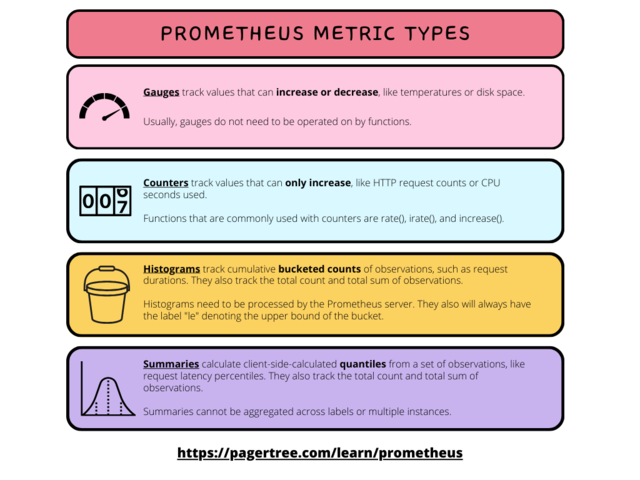
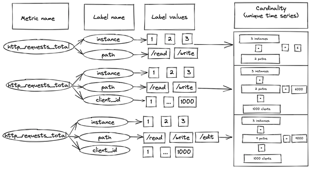
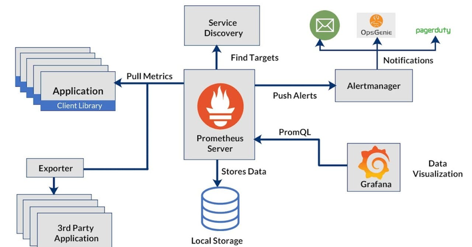
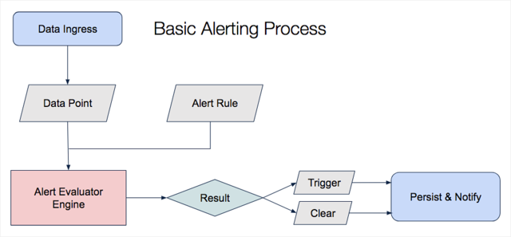
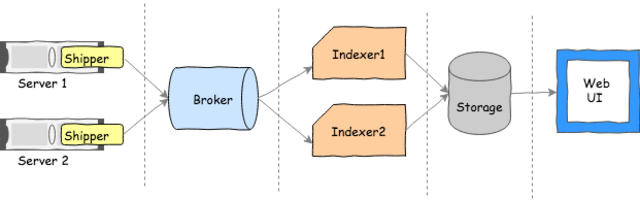
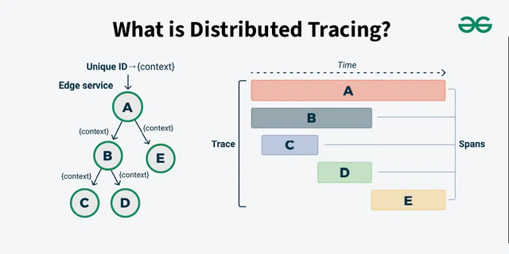

# Observability: Monitoring, Alerting & Observability Stack

## Overview

This document provides a comprehensive guide to observability fundamentals for engineers, covering metrics collection, alerting strategies, distributed tracing, and log aggregation. Observability enables teams to understand system behavior and respond to incidents quickly.

**Core Topics**:

- Metrics (Prometheus, Datadog, Grafana)
- Alerting (rules, escalation, on-call)
- Logging (ELK, Splunk, CloudLogging)
- Distributed tracing (Jaeger, Datadog APM)
- Observability best practices

---

## 1. What is Observability?

**Definition**: The ability to understand the state of a system based on external outputs (metrics, logs, traces).

### The Three Pillars of Observability

```
┌─────────────────────────────────────────────────────────┐
│           OBSERVABILITY                                  │
├─────────────────────────────────────────────────────────┤
│                                                          │
│  ┌──────────────┐  ┌──────────────┐  ┌──────────────┐  │
│  │  METRICS     │  │    LOGS      │  │   TRACES     │  │
│  │              │  │              │  │              │  │
│  │ What & When  │  │ What & Why   │  │ How & Where  │  │
│  │              │  │              │  │              │  │
│  │ Time-series  │  │ Events       │  │ Requests     │  │
│  │ Aggregated   │  │ Detailed     │  │ Distributed  │  │
│  └──────────────┘  └──────────────┘  └──────────────┘  │
│        ↓                  ↓                  ↓           │
│      "Is it fast?"  "Why is it slow?"  "Where is it slow?" │
│                                                          │
└─────────────────────────────────────────────────────────┘
```

### Monitoring vs Observability

| Aspect          | Monitoring          | Observability          |
| --------------- | ------------------- | ---------------------- |
| **Approach**    | Predefined metrics  | All possible data      |
| **Questions**   | Are things working? | Why did this break?    |
| **Output**      | Dashboards, Alerts  | Traces, insights       |
| **Cost**        | Lower (aggregated)  | Higher (detailed)      |
| **When to use** | Production systems  | Development, debugging |

---

## 2. The Four Golden Signals (SLOs)

**Definition**: The four critical metrics that measure application health.

### Signal 1: Latency

**Definition**: How long requests take to complete (in milliseconds/seconds).

```
Metric: request_latency_ms

Visualization:
Min:  5ms    ────────
P50:  50ms   ──────────────────────
P99:  500ms  ─────────────────────────────────────
Max:  2000ms ────────────────────────────────────────────────

Alarm thresholds:
- WARNING: P99 > 200ms
- CRITICAL: P99 > 500ms
```

**Tracking Latency**:

```python
from datadog import initialize, api
from dogstatsd import statsd

# Record latency histogram
start_time = time.time()
result = process_request()
latency_ms = (time.time() - start_time) * 1000

# Send to Datadog
statsd.histogram('request_latency_ms', latency_ms, tags=[
    f'endpoint:{request.path}',
    f'method:{request.method}',
    f'status:{response.status_code}'
])
```

### Signal 2: Traffic

**Definition**: How many requests the system is handling (requests per second).

```
Metric: request_count (counter)

Normal baseline:
  Business hours: 1000 req/sec
  Off hours: 100 req/sec

Spike detection:
  > 5000 req/sec: WARNING
  > 10000 req/sec: CRITICAL

Patterns:
  Time-of-day: Peaks at 9am-12pm UTC
  Day-of-week: High Mon-Fri, low weekends
```

### Signal 3: Errors

**Definition**: The number or percentage of failed requests.

```
Metric: request_count (with status label)

Breakdown:
  2xx (success): 98% of requests
  4xx (client error): 1.5% (user mistake, validation)
  5xx (server error): 0.5% (bugs, outages)

Thresholds:
  ERROR rate > 1%: WARNING
  ERROR rate > 5%: CRITICAL

Error types to track separately:
  - Timeout errors (latency issue)
  - Auth errors (security issue)
  - Resource errors (capacity issue)
```

### Signal 4: Saturation

**Definition**: How much of resource capacity is being used (CPU, memory, disk, connections).

```
Metric: cpu_usage_percent, memory_usage_percent, disk_usage_percent

Thresholds:
  CPU > 70%: WARNING
  CPU > 90%: CRITICAL
  Memory > 80%: WARNING
  Memory > 95%: CRITICAL
  Disk > 85%: WARNING

Database saturation:
  - Connection pool utilization
  - Query queue length
  - Replication lag

Cache saturation:
  - Eviction rate (high = need more cache)
  - Hit rate (low = ineffective cache)
```

---

## 3. Metric Types & Cardinality

### 3.1 Metric Types (Prometheus/Datadog)



#### Counter

```
Definition: Only increases, never decreases (or resets on restart)
Examples: total_requests, errors_count, bytes_processed
Use Case: Cumulative totals, event counts

Datadog Query:
  sum(rate(http_requests_total[5m])) by (status)

Calculation:
  Requests/sec = rate(counter)
  Requests/minute = rate(counter) * 60
```

#### Gauge

```
Definition: Can go up or down at any time
Examples: cpu_usage, memory_bytes, active_connections, temperature
Use Case: Measurements, instantaneous values

Datadog Query:
  avg(system.cpu.user)  # Current CPU usage

Dangerous patterns:
  ❌ Don't sum gauges (meaningless)
  ✅ Do take average (mean state)
```

#### Histogram

```
Definition: Tracks distribution of values (samples multiple observations)
Examples: request_latency, response_size, processing_time
Use Case: Understanding distributions, percentiles (P50, P95, P99)

Pre-computed buckets:
  0.1ms, 0.5ms, 1ms, 5ms, 10ms, 50ms, 100ms, 500ms, 1000ms, ∞

Datadog Histograms auto-generate 5 metrics:
  - count: number of samples
  - min: minimum value
  - max: maximum value
  - sum: total of all values
  - avg: mean (sum / count)

Cardinality impact: 1 histogram = 5 metrics × tag combinations
```

#### Distribution

```
Definition: Similar to histogram, but computed server-side (less precise)
Examples: Datadog's alternative to histogram for cost savings
Use Case: When exact percentiles less important than cardinality control

Datadog Distribution:
  Similar to histogram but creates fewer metrics
  Trade-off: Less accurate percentiles, lower cost
```

---

### 3.2 Metric Cardinality (Critical for Cost)



**Problem**: Each unique combination of tag values = one metric = billing unit

```
Example 1: Counter with path and status tags

request_count{path=?, status=?}

Possible values:
  path: /login, /users, /orders        (3 values)
  status: 200, 400, 500                (3 values)

Cardinality = 3 × 3 = 9 unique metrics
Cost: 9 metrics × billing_rate

Example 2: Same counter as Histogram

Histogram auto-generates 5 metrics (count, min, max, sum, avg)

Cardinality = 9 × 5 = 45 unique metrics!
Cost: 45 metrics × billing_rate


Example 3: High cardinality mistake!

request_count{
  path=?,
  method=?,
  status=?,
  user_id=?,           ← HIGH CARDINALITY!
  request_id=?         ← VERY HIGH CARDINALITY!
}

user_id: 100,000 unique values
request_id: Infinite unique values

Total cardinality: ~INFINITE (every request is unique)
Cost: Unlimited!
```

### 3.3 Cardinality Control Strategies

**Strategy 1: Group by Logic**

```
❌ BAD: Track every path
  /auth/login
  /auth/logout
  /api/users/1
  /api/users/2
  /api/orders/123
  ...

✅ GOOD: Group by prefix
  /auth/*         (authentication APIs)
  /api/*          (API endpoints)
  /health/*       (internal checks)

Cardinality reduction: 1000s → 3
```

**Strategy 2: Sample or Aggregate**

```
❌ BAD: Record every HTTP request as separate metric

✅ GOOD: Aggregate to percentiles
  p50_latency, p95_latency, p99_latency

✅ GOOD: Sample subset (1 in 10 requests)
  - Reduce volume 10x
  - Still statistically valid
```

**Strategy 3: Use Simple Status**

```
❌ BAD: Track status code (too many combinations)
  status: 200, 201, 204, 400, 401, 403, 404, 500, 502, 503, ...

✅ GOOD: Reduce to success/failure
  status: success (2xx)
  status: client_error (4xx)
  status: server_error (5xx)

Cardinality reduction: 10+ → 3
```

**Strategy 4: Cardinality Budget**

```
Set limits and monitor:
  Production service: Max 1000 unique metrics
  Development: Max 500 unique metrics

Alert on cardinality explosion:
  - IF cardinality > budget
  - THEN investigate tag sources
  - DELETE or aggregate problematic metrics
```

---

## 4. Metrics Collection: Prometheus Architecture



### 4.1 Prometheus Components

```
┌─────────────────────────────────────────────────────────────┐
│                 PROMETHEUS MONITORING STACK                │
├─────────────────────────────────────────────────────────────┤
│                                                              │
│  ┌──────────────┐                    ┌──────────────┐      │
│  │ Application  │ Exposes metrics    │ Prometheus   │      │
│  │ Pod 1        │ at :8080/metrics   │ Server       │      │
│  └──────────────┘ (Prometheus format)└──────────────┘      │
│       │                               │                     │
│  ┌────▼──────────┐                   │                     │
│  │ Application   │ Scrapes every     │                     │
│  │ Pod 2         │ 15 seconds        │                     │
│  └───────────────┘                   │                     │
│                                      ▼                     │
│  ┌──────────────┐              ┌──────────────┐           │
│  │ Node Exporter│              │ Time-series  │           │
│  │(CPU, memory) │──scrape──→  │ Database     │           │
│  └──────────────┘              │ (TSDB)       │           │
│                                 └──────────────┘           │
│  ┌──────────────┐                    │                    │
│  │ Service      │                    │                    │
│  │ Monitor      │────scrape────→    │ (Storage)          │
│  └──────────────┘                    │ 15 days retention  │
│                                      ▼                    │
│                               ┌──────────────┐            │
│                               │ AlertManager │            │
│                               │ (Rules eval) │            │
│                               └──────────────┘            │
│                                      │                    │
│                          Fires alerts when rules match    │
│                                      │                    │
│                      ┌───────────────┴────────────┐       │
│                      ▼                            ▼       │
│                  ┌────────┐                 ┌─────────┐   │
│                  │ Webhook │                │ Slack   │   │
│                  │ (OpsGenie)               │ (Chat)  │   │
│                  └────────┘                 └─────────┘   │
│                                                           │
└─────────────────────────────────────────────────────────────┘
```

### 4.2 Exposing Metrics (Pull Model)

**Application exposes metrics endpoint**:

```
GET http://app:8080/metrics

Output (Prometheus text format):
# HELP http_request_duration_seconds Request latency
# TYPE http_request_duration_seconds histogram
http_request_duration_seconds_bucket{le="0.1",path="/login",status="200"} 100
http_request_duration_seconds_bucket{le="0.5",path="/login",status="200"} 150
http_request_duration_seconds_bucket{le="1",path="/login",status="200"} 180
http_request_duration_seconds_bucket{le="+Inf",path="/login",status="200"} 200
http_request_duration_seconds_sum{path="/login",status="200"} 45.5
http_request_duration_seconds_count{path="/login",status="200"} 200

http_requests_total{endpoint="/login",status="200"} 1500
http_requests_total{endpoint="/login",status="400"} 50
http_requests_total{endpoint="/users",status="200"} 3000
```

### 4.3 Prometheus Query Language (PromQL)

```
# Simple query: Get current value
http_requests_total

# Rate over time: Requests per second
rate(http_requests_total[5m])

# Sum by label: Total requests by endpoint
sum(rate(http_requests_total[5m])) by (endpoint)

# Condition: Requests > 100/sec
rate(http_requests_total[5m]) > 100

# Percentile: P95 latency
histogram_quantile(0.95,
  sum(rate(http_request_duration_seconds_bucket[5m])) by (le)
)

# Range: Get values over 1 hour
http_requests_total[1h]
```

---

## 5. Datadog: Alternative to Prometheus

### 5.1 Datadog vs Prometheus

| Aspect        | Prometheus         | Datadog                |
| ------------- | ------------------ | ---------------------- |
| **Model**     | Pull-based         | Push + Pull            |
| **Cost**      | Free (self-hosted) | Expensive (per metric) |
| **Storage**   | 15 days default    | 15 months              |
| **APM**       | External (Jaeger)  | Built-in               |
| **Setup**     | Complex            | Simple                 |
| **Retention** | Limited            | Long-term              |
| **UI**        | Basic              | Very advanced          |

### 5.2 DogStatsD: Datadog Client

**Push metrics directly to Datadog**:

```python
from datadog import initialize, api
from dogstatsd import statsd
import time

# Configure Datadog client
options = {
    'api_key': 'YOUR_API_KEY',
    'app_key': 'YOUR_APP_KEY'
}
initialize(**options)

# In your request handler
start = time.time()

try:
    result = process_request(request)
    status = 200
except Exception as e:
    status = 500

# Record metrics
latency_ms = (time.time() - start) * 1000

# Counter (increment total)
statsd.increment('requests.total', tags=[
    f'endpoint:{request.path}',
    f'status:{status}',
    f'method:{request.method}'
])

# Histogram (track distribution)
statsd.histogram('request_latency_ms', latency_ms, tags=[
    f'endpoint:{request.path}',
    f'status:{status}'
])

# Gauge (current value)
statsd.gauge('active_connections', current_connections)
```

### 5.3 Datadog Metric Cardinality Calculation

```
Example: API metrics with path and status tags

Counter: api_calls{path=?, status=?}
  path: /auth/login, /auth/logout, /api/users, /api/orders     (4 values)
  status: 200, 400, 500                                         (3 values)

  Cardinality = 4 × 3 = 12 unique metrics

Histogram: request_latency{path=?, status=?}
  Same as above, but histogram creates 5 metrics:
    - .avg     (average)
    - .count   (number of observations)
    - .max     (maximum)
    - .min     (minimum)
    - .sum     (total)

  Cardinality = 12 × 5 = 60 unique metrics

Distribution: response_size{path=?, status=?}
  Creates fewer metrics (3-5 depending on config)
  Cardinality = 12 × 3 = 36 unique metrics (lower cost)
```

---

## 6. Alerting: Rules and Escalation



### 6.1 Alert Rules

**Example: Latency Alert**

```yaml
groups:
  - name: application_alerts
    rules:
      - alert: HighLatency
        expr: histogram_quantile(0.99, rate(http_request_duration_seconds_bucket[5m])) > 0.5
        for: 5m # Alert only if condition true for 5 minutes (avoid flapping)
        annotations:
          summary: "High P99 latency detected"
          description: "P99 latency is {{ $value }}s (threshold: 0.5s)"
        labels:
          severity: warning
          team: backend

      - alert: CriticalLatency
        expr: histogram_quantile(0.99, rate(http_request_duration_seconds_bucket[5m])) > 1.0
        for: 2m # Critical: fire faster
        labels:
          severity: critical
```

### 6.2 Escalation Policy

```
┌─────────────────────────────────────────┐
│ Alert Rule Fires (P99 latency > 1s)    │
└──────────────┬──────────────────────────┘
               │
               ▼
        ┌──────────────┐
        │ Notify User  │
        │ (On-call)    │  ← Waits 5 minutes for ACK
        └──────┬───────┘
               │
        No ACK? │ (Escalation triggered)
               ▼
        ┌──────────────┐
        │ Notify Team  │  ← Waits 5 minutes for ACK
        │ Lead         │
        └──────┬───────┘
               │
        No ACK? │ (Further escalation)
               ▼
        ┌──────────────┐
        │ Notify       │
        │ Manager      │
        └──────────────┘
```

### 6.3 Alert Thresholds

**Golden Signals Alerting Strategy**:

```yaml
# Latency Alert
- alert: HighLatency
  expr: histogram_quantile(0.99, ...) > 0.5 # P99 > 500ms
  severity: warning

- alert: CriticalLatency
  expr: histogram_quantile(0.99, ...) > 1.0 # P99 > 1s
  severity: critical

# Error Rate Alert
- alert: HighErrorRate
  expr: rate(http_requests_total{status=~"5.."}[5m]) > 0.01 # > 1%
  severity: warning

- alert: CriticalErrorRate
  expr: rate(http_requests_total{status=~"5.."}[5m]) > 0.05 # > 5%
  severity: critical

# Traffic Alert (unusual patterns)
- alert: TrafficSpike
  expr: rate(http_requests_total[5m]) > 2 * avg_over_time(rate(http_requests_total[5m])[1h])
  # If traffic > 2x average, alert
  severity: warning

# Saturation Alert
- alert: HighCPU
  expr: rate(node_cpu_seconds_total[5m]) > 0.8 # > 80%
  severity: warning

- alert: CriticalMemory
  expr: node_memory_MemAvailable_bytes / node_memory_MemTotal_bytes < 0.1 # < 10% free
  severity: critical
```

---

## 7. Logging: ELK Stack & Aggregation



### 7.1 Three Types of Logs

**Structured Logs** (Preferred):

```json
{
  "timestamp": "2024-01-28T10:30:45.123Z",
  "level": "ERROR",
  "service": "order-api",
  "request_id": "abc-123-def-456",
  "user_id": "user_789",
  "error": {
    "message": "Database connection timeout",
    "type": "TimeoutError",
    "stack_trace": "..."
  },
  "context": {
    "endpoint": "/api/orders",
    "method": "POST",
    "duration_ms": 5012
  },
  "tags": {
    "environment": "production",
    "region": "us-west"
  }
}
```

**Unstructured Logs** (Bad):

```
2024-01-28 10:30:45 order-api ERROR Database connection timeout (trying to order from user) at endpoint /api/orders after 5 seconds
```

**Semi-structured Logs** (Acceptable):

```
[2024-01-28 10:30:45] ERROR order-api - Database timeout for user_id=user_789 request_id=abc-123
```

### 7.2 Log Levels

| Level     | Use Case           | Example                                      |
| --------- | ------------------ | -------------------------------------------- |
| **DEBUG** | Development        | Variable values, function entry/exit         |
| **INFO**  | Important events   | User login, request completed, config loaded |
| **WARN**  | Recoverable issues | Retry attempt, resource limit approaching    |
| **ERROR** | Failures           | Request failed, service unavailable          |
| **FATAL** | Critical errors    | Application crashed, data loss               |

### 7.3 ELK Stack Components

```
Elasticsearch  ← Database (indices)
Logstash       ← Parser/Filter (transform logs)
Kibana         ← Visualization UI

Pipeline:
Application → Logstash → Elasticsearch → Kibana (Dashboard)
```

---

## 8. Distributed Tracing: Request Journey



**Definition**: Follows a single request through multiple services.

```
User Request
    │
    ▼
┌──────────────────────────┐
│ API Gateway              │  Span 1: api-gateway (10ms)
│ (trace_id=abc-123)       │    └─ Span 2: auth-service (5ms)
└──────────────────────────┘         └─ Span 3: db-query (2ms)
    │
    ├──→ Auth Service               Span 4: order-service (80ms)
    │         │                         ├─ Span 5: validate (10ms)
    │         └──→ Database Query      ├─ Span 6: payment (50ms)
    │                                  │   └─ Span 7: payment-api (45ms)
    ├──→ Order Service                └─ Span 8: db-write (15ms)
    │         │
    │         ├──→ Payment Service   Span 9: notification (20ms)
    │         │
    │         └──→ Database Write
    │
    └──→ Notification Service

Total request duration: ~135ms
Trace shows:
  - Which service was slow
  - Where time was spent
  - Which requests failed
  - Service dependencies
```

---

## 9. Dashboards: Visualizing Observability

### 9.1 Golden Signal Dashboard

```
┌─────────────────────────────────────────────────────┐
│        Production System Health Dashboard           │
├─────────────────────────────────────────────────────┤
│                                                      │
│  Latency (P99)           Errors (Rate)              │
│  ├─ 150ms ████░░░        ├─ 0.2% ░░░░░             │
│  └ OK                     └ OK                       │
│                                                      │
│  Traffic (Req/sec)       Saturation (CPU)          │
│  ├─ 5200 ███░░░░         ├─ 65% ████░░░░░         │
│  └ Normal                 └ OK                       │
│                                                      │
├─────────────────────────────────────────────────────┤
│ Recent Alerts:                                       │
│  • 10:25 - HighLatency: P99 > 500ms (RESOLVED)    │
│  • 09:50 - ServiceDown: API unavailable (RESOLVED) │
│                                                      │
└─────────────────────────────────────────────────────┘
```

### 9.2 Service-Specific Dashboard

```
Service: Order Service

Key Metrics:
- Request Rate: 1250/sec (↑ 5% from yesterday)
- P50 Latency: 45ms
- P95 Latency: 180ms
- P99 Latency: 500ms
- Error Rate: 0.5% (5xx errors)
- CPU Usage: 60%
- Memory Usage: 75%

Critical Alert Rules:
- P99 > 1000ms → Team alert
- Error Rate > 5% → Escalate to manager
- CPU > 90% → Capacity alert
```

---

## 10. Observability Best Practices

### 10.1 Metric Naming Conventions

```yaml
Bad:
  cpu            (ambiguous: user? system? total?)
  response_time  (units unclear)
  api_calls      (can go down?)

Good:
  system_cpu_usage_percent         (metric_target_units)
  http_request_duration_seconds    (metric_operation_unit)
  http_requests_total              (metric_type)

  container_memory_bytes           (per pod memory)
  database_connections_active      (current count)
  cache_hit_ratio                  (percentage)
```

### 10.2 Tagging Best Practices

```yaml
✅ DO:
  - Use consistent tag names (service, environment, region)
  - Keep tag cardinality low (few distinct values)
  - Use tags for operational context

❌ DON'T:
  - Use high-cardinality tags (user_id, request_id)
  - Use unbounded values (timestamps)
  - Create too many tags per metric

Good tags:
  - environment: prod, staging, dev
  - service: order-api, payment-service
  - region: us-west, eu-central
  - version: v1.0, v1.1
  - team: backend, platform

Avoid:
  - customer_id: (100k+ values)
  - request_id: (infinite values)
  - timestamp: (unbounded)
```

### 10.3 Alerting Best Practices

```yaml
Alert Design:

1. Meaningful Title:
   ✅ "OrderService P99 latency > 1s"
   ❌ "HighLatency"

2. Clear Description:
   ✅ "P99 latency is 1.2s (threshold: 1.0s) for past 5 minutes"
   ❌ "Alert triggered"

3. Actionable Severity:
   ✅ WARNING: P99 > 500ms  (investigate)
   ✅ CRITICAL: P99 > 1s    (immediate action)
   ❌ All alerts same severity

4. Low false positives:
   ✅ Alert if condition true for 5+ minutes (not single spike)
   ❌ Alert on every temporary spike

5. Runbook link:
   ✅ Includes troubleshooting guide
   ❌ No guidance for on-call responder
```

---

## 11. Alert Response Workflow

```
┌─────────────────────────────────────────────────────┐
│ ALERT FIRED: "OrderService P99 > 1s"               │
├─────────────────────────────────────────────────────┤
│                                                      │
│ Notification sent to on-call (via Slack, PagerDuty)│
│                                                      │
│ On-call Engineer:                                    │
│  1. Check dashboard → P99 latency graph             │
│  2. Check metrics → Error rate, CPU, memory?        │
│  3. Check logs → Error messages, stack traces       │
│  4. Check traces → Where is time being spent?       │
│  5. Check services → Health status, recent deploys  │
│                                                      │
│ Diagnosis:                                           │
│  "Database query taking 800ms (was 50ms before)"   │
│                                                      │
│ Action:                                              │
│  Option A: Rollback last deployment                │
│  Option B: Add database index (if long-term)       │
│  Option C: Scale up database connection pool       │
│                                                      │
│ Resolution:                                          │
│  Latency back to 150ms → Alert RESOLVED            │
│                                                      │
└─────────────────────────────────────────────────────┘
```

---

## 12. Observability Costs & Optimization

### Cost Drivers

```
Metric cardinality (most expensive):
  - Each unique metric = billing unit
  - Histogram/distribution = × 5 multiplier

Example cost:
  10,000 unique metrics × $0.10/metric = $1000/month

Log ingestion (high volume):
  - GB of logs stored = billing unit

Example cost:
  100 GB/month × $0.50/GB = $50/month

Trace sampling (can be sampled):
  - Only trace 10% of requests = 10× cost reduction
```

### Optimization Strategies

```
1. Cardinality reduction:
   ✅ Group by logic (paths → prefixes)
   ✅ Sample (1 in 10 requests)
   ✅ Use simpler metrics (count vs histogram)

2. Log optimization:
   ✅ Sample high-volume logs
   ✅ Aggregate similar errors
   ✅ Archive old logs

3. Trace optimization:
   ✅ Tail-based sampling (sample on errors)
   ✅ Span-level filtering
   ✅ Sample by service
```

---

## 13. Key Takeaways

1. **Metrics answer "What & When"** — Use histograms for latency, counters for traffic
2. **Logs answer "What & Why"** — Use structured JSON logs
3. **Traces answer "Where & How"** — Follow requests across services
4. **Cardinality is critical** — Control tag combinations to manage costs
5. **Alert on symptoms, not metrics** — "High latency" not "CPU at 85%"
6. **Runbooks essential** — Include troubleshooting steps with every alert
7. **Observe early, alert late** — Collect everything, alert on important things
8. **Golden Signals matter** — Latency, Traffic, Errors, Saturation

---

## Additional Resources

- [Prometheus Official Docs](https://prometheus.io/docs/)
- [Datadog Documentation](https://docs.datadoghq.com/)
- [Google SRE Book - Monitoring](https://sre.google/sre-book/monitoring-distributed-systems/)
- [Elastic Stack (ELK) Docs](https://www.elastic.co/guide/index.html)
- [Jaeger Distributed Tracing](https://www.jaegertracing.io/docs/)

---

**Last Updated**: January 2026
